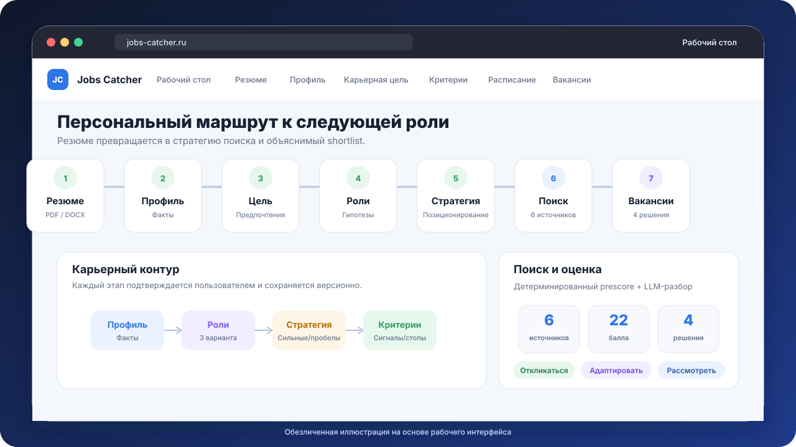
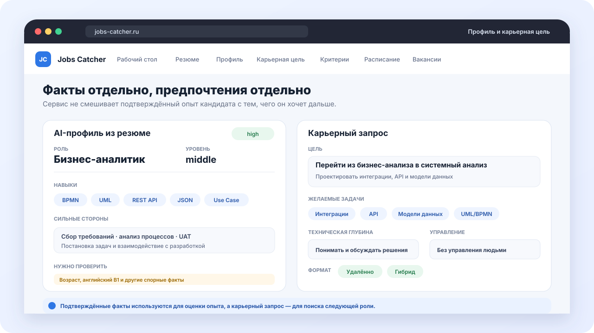
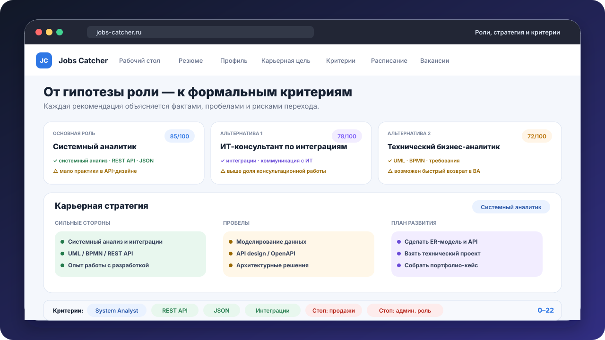
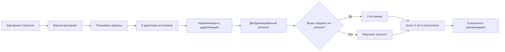
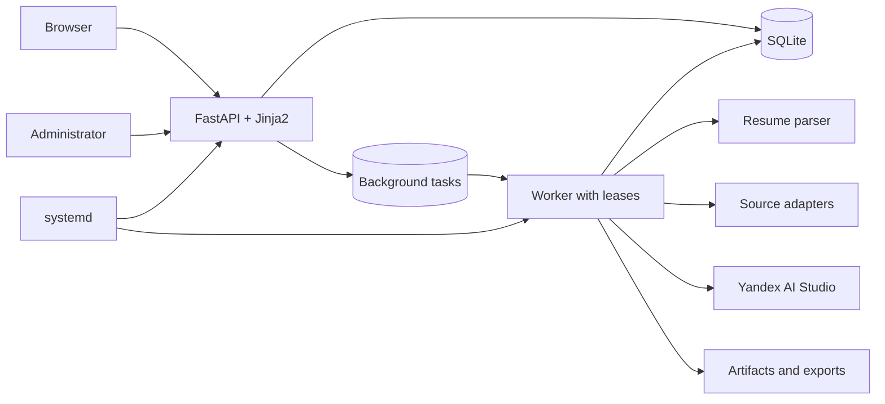

# Jobs Catcher

### Персональный AI-сервис для осознанного поиска следующей роли

От резюме и карьерного запроса — к стратегии, персональным критериям и объяснимому shortlist вакансий.

[Открыть демо](https://jobs-catcher.ru) · доступ выдаётся вручную

> **Public portfolio showcase.** Рабочая реализация, пользовательские резюме, критерии, база вакансий, ключи и эксплуатационные артефакты находятся в закрытом контуре. Этот репозиторий показывает продуктовую логику, архитектуру и обезличенный интерфейс.

## Главная идея

Обычный агрегатор помогает найти вакансии по названию. Jobs Catcher решает более сложную задачу: **понять, какая следующая роль подходит конкретному человеку, формализовать переход и искать вакансии уже по этой стратегии**.

| Обычный поиск | Jobs Catcher |
| --- | --- |
| Поиск по одному job title | Основная и смежные целевые роли |
| Резюме используется только для отклика | Из резюме строится подтверждённый профиль кандидата |
| Предпочтения остаются «в голове» | Карьерный запрос хранится отдельно от фактов опыта |
| Десятки похожих карточек | Prescore, LLM-разбор и объяснимое решение |
| Один список результатов | «Откликаться», «Адаптировать», «Рассмотреть», «Мимо» |

  

*Обезличенная иллюстрация текущего рабочего интерфейса.*

## Пользовательский путь

| Этап | Что происходит | Результат |
| --- | --- | --- |
| 1. Резюме | Пользователь загружает PDF или DOCX | Извлечённый текст и версия документа |
| 2. Профиль | AI выделяет роль, уровень, навыки, опыт и спорные факты | Подтверждённый профиль кандидата |
| 3. Карьерная цель | Пользователь описывает желаемые и нежелательные задачи, глубину и формат работы | Карьерный запрос, отделённый от резюме |
| 4. Целевые роли | Сервис предлагает основную и две альтернативные роли | Объяснённые role hypotheses с рисками |
| 5. Стратегия | Формируются позиционирование, сильные стороны, пробелы и план развития | Подтверждённая карьерная стратегия |
| 6. Критерии и поиск | Стратегия переводится в запросы, сигналы и стоп-факторы | Версионируемые критерии и расписание |
| 7. Вакансии | Источники собираются, нормализуются и оцениваются | Shortlist, рекомендации и письмо |

## Интерфейс и продуктовая логика

### Факты кандидата и карьерные предпочтения не смешиваются

Резюме отвечает на вопрос «что человек уже делал». Карьерный запрос — «что он хочет делать дальше». Разделение снижает риск того, что LLM примет желание за подтверждённый опыт.

  

### Рекомендации объясняются, а затем превращаются в критерии

Сервис показывает подтверждающие сигналы, пробелы и риски для каждой роли. После выбора роли создаётся стратегия, а из неё — поисковые запросы, позитивные сигналы и стоп-факторы.

  

Демо-сценарий на иллюстрациях: **middle бизнес-аналитик переходит в системный анализ**. Все данные вымышлены и предназначены только для показа продукта.

## Как оцениваются вакансии

Поддерживаются hh.ru, Habr Career, SuperJob, Работа.ру, GeekJob и GetMatch. Ошибка одного источника не останавливает весь запуск; CAPTCHA, rate limits и антибот-защита не обходятся.

LLM получает уже нормализованную вакансию и подтверждённые критерии. Ответ валидируется локально, а итог содержит совпадения, отсутствующие сигналы, стоп-факторы, риски и рекомендации по адаптации резюме.

## Архитектура

Веб-приложение и worker запускаются отдельно. FastAPI отвечает за интерфейс, аутентификацию, CSRF и постановку длительных операций в очередь. Worker разбирает резюме, генерирует карьерные материалы, запускает поиск, выполняет оценивание и восстанавливает просроченные leases.

Все пользовательские сущности привязаны к `user_id`: профили, стратегии, критерии, оценки, письма и статусы просмотра изолированы между аккаунтами.

## Ключевые продуктовые решения

| Решение | Зачем оно нужно |
| --- | --- |
| Подтверждение после каждого AI-этапа | Пользователь контролирует факты и направление поиска |
| Версии профиля, стратегии и критериев | Результаты можно воспроизвести и связать с конкретным поиском |
| Детерминированный prescore перед LLM | Снижает стоимость и сохраняет базовую воспроизводимость |
| Отдельный worker и очередь задач | Длительные операции не блокируют web-интерфейс |
| Fallback и локальная валидация ответов | Недоступность или ошибочный ответ модели не ломает основной путь |
| Human-in-the-loop | Сервис рекомендует и объясняет, финальное решение остаётся у человека |

## Технологический стек

- **Python 3.12, FastAPI, Starlette, Uvicorn** — web-приложение и API;
- **Jinja2** — серверный интерфейс без отдельного SPA;
- **SQLAlchemy, Alembic, SQLite** — данные, миграции и очередь задач;
- **Pydantic, PyYAML** — схемы и версионируемые критерии;
- **httpx** — интеграции с источниками вакансий и LLM;
- **pypdf** — извлечение текста из резюме;
- **Yandex AI Studio** — профиль, роли, стратегия, критерии, оценка и письма;
- **Argon2id, server-side sessions, CSRF** — защита пользовательского контура;
- **pytest, smoke checks, systemd** — тестирование и эксплуатация.

## Граница публичной версии

| В публичной витрине | В закрытом рабочем контуре |
| --- | --- |
| Описание продукта и пользовательского пути | Исходный код рабочей версии |
| Обезличенные SVG-иллюстрации интерфейса | Загруженные резюме и персональные профили |
| Архитектура и ключевые решения | База вакансий, оценки и письма |
| Ссылка на контролируемое демо | Ключи, `.env`, логи и systemd-конфигурация |

Репозиторий не является open-source поставкой сервиса. Его задача — показать продукт, ход проектирования и инженерные решения без публикации персональных и эксплуатационных данных.

## Почему это портфолио-кейс

Jobs Catcher демонстрирует полный цикл AI-first продукта:

- формулирование пользовательской проблемы и проектирование end-to-end пути;
- перевод неструктурированного карьерного запроса в формальные критерии;
- построение workflow с несколькими LLM-этапами, подтверждением и fallback;
- интеграцию нескольких внешних источников, нормализацию и дедупликацию;
- сочетание правил и LLM в объяснимой системе оценивания;
- проектирование многопользовательского web-приложения, worker и модели данных;
- работу с безопасностью, стоимостью, отказоустойчивостью и эксплуатацией.

---

**Jobs Catcher** — от опыта кандидата к обоснованному решению, куда двигаться дальше.

