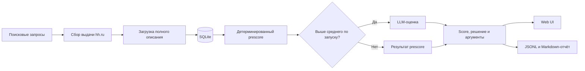
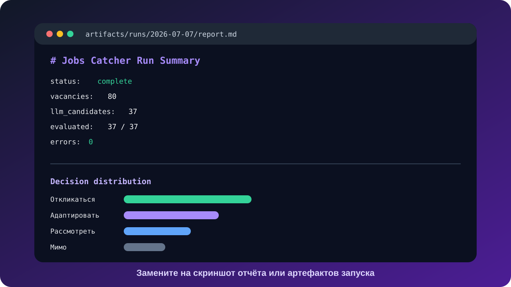

<div align="center">

# Jobs Catcher

### AI-assisted поиск, оценка и приоритизация вакансий

Jobs Catcher превращает поток вакансий hh.ru в компактный и объяснимый shortlist: собирает свежие позиции, загружает полные описания, оценивает соответствие карьерным критериям и показывает результат в удобном web-интерфейсе.


</div>

> **Public showcase edition.** Репозиторий предназначен для отдельной публичной версии продукта. Персональные карьерные критерии, рабочая база вакансий, отчёты запусков и VPS-конфигурация остаются в закрытом контуре.

## Зачем нужен Jobs Catcher

Классический поиск вакансий быстро превращается в ручную обработку десятков похожих карточек. Название должности часто мало говорит о реальных задачах, а нужная роль может скрываться под разными формулировками.

Jobs Catcher переносит фокус с ключевого слова в заголовке на **содержание вакансии и соответствие карьерной стратегии**.

| Обычный поиск | Jobs Catcher |
| --- | --- |
| Список вакансий по ключевым словам | Поиск по набору ролевых и технологических сигналов |
| Быстрый просмотр сниппета | Проверка полного описания вакансии |
| Ручное сравнение десятков позиций | Единый score, решение и объяснение |
| Критерии остаются «в голове» | Версионируемая система критериев |
| Сложно понять, что уже просмотрено | Фильтры, статусы и отметка просмотра |

## Как работает продукт



1. **Поиск** запускается по набору запросов, связанных с целевыми ролями и AI-направлениями.
2. **Полное описание** загружается до сохранения вакансии в основную базу.
3. **Prescore** быстро проверяет все позиции по формализованным сигналам.
4. **LLM-оценка** подробно разбирает наиболее перспективные вакансии.
5. **Результат** сохраняется в SQLite, JSONL-артефакты и человекочитаемый отчёт.
6. **Web UI** помогает отфильтровать shortlist и перейти к осознанному отклику.

## Что умеет Jobs Catcher

| Возможность | Что даёт пользователю |
| --- | --- |
| Поиск по нескольким ролевым формулировкам | Находит релевантные вакансии за пределами одного job title |
| Full-description gate | Исключает решения, принятые только по короткому сниппету |
| Гибридный скоринг | Сочетает воспроизводимый prescore и содержательный LLM-разбор |
| Объяснимая оценка | Показывает сильные сигналы, пробелы, риски и вопросы для проверки |
| Четыре понятных решения | «Откликаться», «Адаптировать резюме», «Рассмотреть», «Мимо» |
| Локальное хранилище | Сохраняет историю поиска и оценок в SQLite |
| Web-интерфейс | Даёт фильтры по городу, баллу, дате, решению и просмотрам |
| Артефакты каждого запуска | Упрощают аудит, отладку и повторную обработку |
| Регулярный agent cycle | Поддерживает автоматический запуск на VPS через systemd |

## Интерфейс

<!-- SCREENSHOT SLOT 1: replace docs/images/dashboard-overview.svg with a real dashboard screenshot -->


*Главный экран: воронка решений, фильтры и ранжированный список вакансий.*

<!-- SCREENSHOT SLOT 2: replace docs/images/vacancy-details.svg with a real vacancy details screenshot -->


*Детальная панель: описание, matching signals, red flags, вопросы для проверки и подсказки для адаптации резюме.*

<!-- SCREENSHOT SLOT 3: replace docs/images/run-report.svg with a real run report screenshot -->



*Артефакты запуска: статус конвейера, объём выборки, прогресс оценки и ошибки обработки.*

## Система оценки

Каждая вакансия проходит через два уровня анализа.

### 1. Детерминированный prescore

Prescore проверяет формализованные признаки: AI/LLM, RAG, AI agents, product ownership, системный анализ, API и интеграции, PoC/MVP, внедрение, а также нежелательные профили вроде чистой ML-разработки, BI или продаж.

Этот этап:

- обрабатывает всю сохранённую выборку;
- даёт воспроизводимый базовый результат;
- сокращает объём дорогой LLM-оценки;
- сохраняет причины предварительного решения.

### 2. LLM-оценка

Наиболее перспективные позиции получают расширенный разбор с итоговой оценкой до **22 баллов**.

В результат входят:

- соответствие целевой роли;
- подтверждающие сигналы;
- недостающие сигналы;
- красные флаги;
- вопросы, которые стоит проверить до отклика;
- угол адаптации резюме;
- итоговое решение и уверенность оценки.

## Архитектура

```text
jobs-catcher
├── config/                 # параметры поиска и agent cycle
├── data/                   # локальная SQLite-база
├── scripts/
│   ├── run_hh_search.py    # поиск и загрузка вакансий
│   ├── run_agent_cycle.py  # prescore, LLM-артефакты и импорт
│   └── serve_ui.py         # локальный HTTP API и web-сервер
├── web/                    # интерфейс на HTML, CSS и JavaScript
├── artifacts/runs/         # воспроизводимые артефакты запусков
├── reports/                # человекочитаемые отчёты
├── deploy/systemd/         # регулярный запуск на VPS
└── tests/                  # проверки ключевой логики
```

### Технологический стек

- **Python** — сбор данных, pipeline, API и служебные команды;
- **SQLite** — локальное canonical storage без внешней инфраструктуры;
- **HTML / CSS / JavaScript** — лёгкий интерфейс без frontend-фреймворка;
- **JSONL / Markdown** — прозрачные входы, выходы и отчёты agent cycle;
- **Codex / LLM evaluator** — содержательная оценка вакансий по критериям;
- **systemd** — регулярный запуск и эксплуатация на VPS.

## Принципы реализации

### Объяснимость

Пользователь получает аргументы, сигналы и риски вместе с итоговым баллом. Решение можно проверить и скорректировать.

### Управляемая стоимость

LLM вызывается для отобранной части выборки. Простые и слабые совпадения обрабатываются deterministic-логикой.

### Локальность данных

Рабочая база и персональные критерии могут храниться локально. Публичная версия использует обезличенные примеры и demo-данные.

### Бережный сбор данных

Поиск выполняется последовательно, с задержками, ограничением количества результатов и фиксацией captcha, HTTP 403/429 и сетевых ошибок. Механизмы обхода защиты не используются.

### Human-in-the-loop

Jobs Catcher помогает принять решение и подготовить отклик. Финальный выбор и отправка отклика остаются за пользователем.

## Граница публичной версии

| Публичная витрина | Закрытый рабочий контур |
| --- | --- |
| Обобщённый pipeline | Персональная карьерная стратегия |
| Пример критериев оценки | Реальные критерии и их веса |
| Demo-конфигурация | Рабочие поисковые запросы и расписание |
| Обезличенный набор данных | SQLite с реальными вакансиями |
| UI и архитектурная документация | Логи, отчёты и run-артефакты |

Такой подход позволяет показать продукт, архитектуру и инженерные решения без публикации персональных данных и операционной конфигурации.

## Почему это портфолио-кейс

Jobs Catcher демонстрирует полный цикл создания AI-first продукта:

- формулирование пользовательской проблемы;
- перевод карьерной стратегии в формальные критерии;
- проектирование data pipeline и локального хранилища;
- сочетание правил и LLM в одном решении;
- создание собственного интерфейса;
- эксплуатацию регулярного агентского процесса;
- работу с ограничениями, стоимостью, рисками и объяснимостью AI.

## Статус

Публичный репозиторий формируется как отдельная showcase-версия проекта. README и визуальная структура подготовлены для переноса обезличенного кода, demo-конфигурации и скриншотов продукта.

---

<div align="center">

**Jobs Catcher** — персональный AI-инструмент для осознанного поиска следующей роли.

</div>
